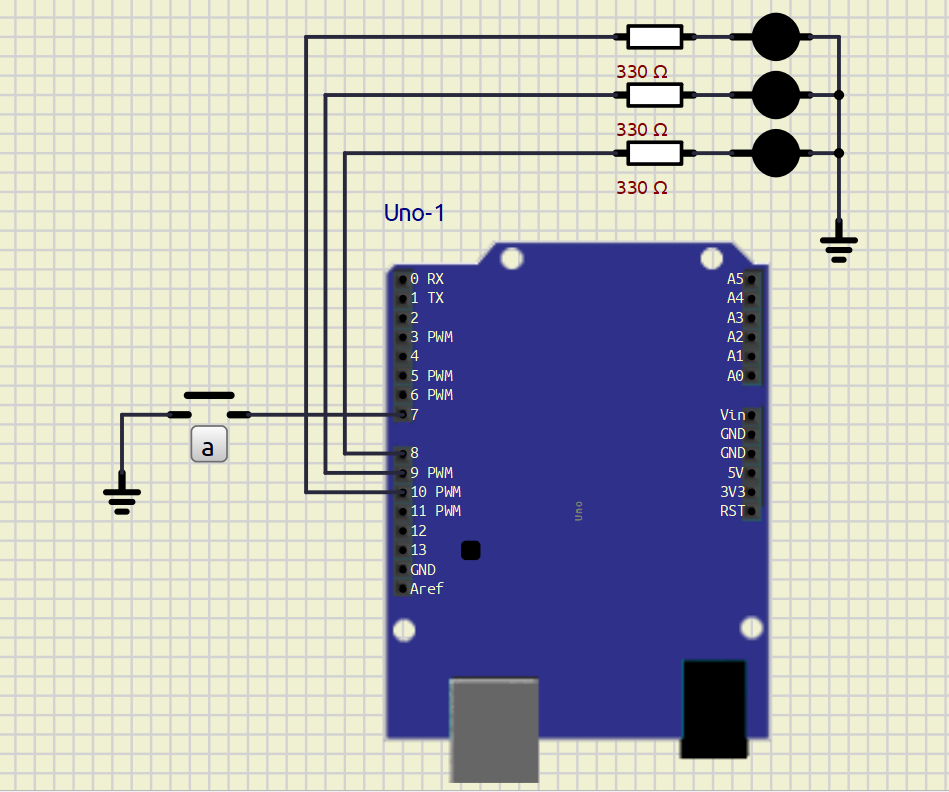

# 🔐 Semáforo con botón para cruce peatonal usando Arduino

Proyecto de un semáforo con botón para cruce peatonal usando Arduino.

Este proyecto fue desarrollado como práctica de microcontroladores.

---

## 📦 Requisitos

- Arduino IDE
- SimulIDE
- Git (opcional, para clonar)

---

## ⬇️ Descarga del proyecto

### Opción 1: Descargar desde GitHub como ZIP
1. En el repositorio de GitHub, haz clic en **Code → Download ZIP**
2. Extrae el archivo descargado

### Opción 2: Clonar con Git
```bash
git clone https://github.com/AlejandroCastro02/semaforo_cruce_peatonal.git
```
---

## 📁 Instalación en SimulIDE

1. Abre el programa SimulIDE y selecciona el archivo **semaforo_cruce_peatonal.sim1**

2. Abre el programa Arduino IDE con el código de **semaforo_cruce_peatonal.ino**, compila y recolecta el archivo .hex

3. Selecciona el microcontrolador Arduino del archivo y carga su firmware con el .hex obtenido.



---


## 👨‍💻 Autor

Alejandro Castro  
Proyecto de práctica de regulación de temperatura para sistema acuapónico usando Arduino.
